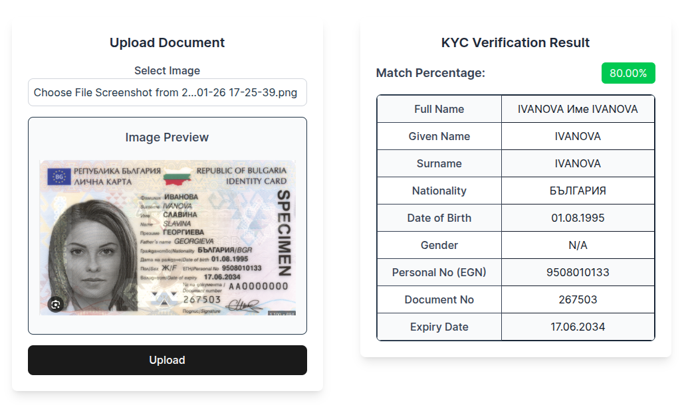

# AI tool for KYC and OCR user profile matching

A React application that performs Optical Character Recognition (OCR) on ID documents for KYC (Know Your Customer) verification using Google Cloud Vision API.

✅ Matches extracted data with user profile for validation  
✅ Uses AI-powered text recognition for accuracy  
✅ Real-time results display  
✅ Dockerized for easy deployment  



## Features
- Image upload and processing
- OCR text extraction from ID documents
- Automatic field detection for:
  - Full Name
  - Given Name
  - Surname
  - Nationality
  - Date of Birth
  - Gender
  - Personal Number
  - Document Number
  - Expiry Date
- Match percentage calculation against expected values
- Real-time results display

## Tech Stack
- React + TypeScript + Vite + TailwindCSS
- Redux Toolkit for state management
- Axios for API requests
- Google Cloud Vision API for OCR
- Vite as build tool

## Prerequisites

- Node.js (v14 or higher)
- Google Cloud Platform account with Vision API enabled
- Valid Google Cloud credentials

## Environment Variables

Create a `.env` file in the root directory with:

```env
VITE_GOOGLE_VISION_API_KEY=your_api_key
VITE_GOOGLE_CLOUD_PROJECT_ID=your_project_id
VITE_BACKEND_URL=your_backend_url
```

## Usage

1. Upload an ID document image
2. The application will process the image using Google Cloud Vision API
3. Extracted information will be displayed along with a match percentage of profile information
4. Results can be reviewed in the UI

## Docker Setup

### Prerequisites
- Docker
- Docker Compose

### Running the Application
1. Start the containers:
```bash
docker-compose up
```

2. Access the services:
- Frontend: http://localhost:5173
- Backend: http://localhost:5000

### Development
- Changes in source code will automatically reflect due to volume mounting
- To rebuild containers after dependency changes:
```bash
docker-compose up --build
```

### Stopping the Application
```bash
docker-compose down
```

## License
MIT